# 基于RSSI的ZigBee室内定位 

## 使用说明

上、下位机解压需注意问题，由于IAR的特殊性，文件路径不要包括汉字，全部使用英文或者数字，而且路径尽量短，也就是最好放在某个盘的根目录下
下位机部分：下位机文件夹中主要包括三部分内容，分别为BLINDNODE文件夹（全部的盲节点代码）、COORDINATOR文件夹（全部的协调器代码）、ROUTER文件夹（全部三个锚节点代码） 

### 1、 由于盲节点（待测节点）和协调器节点下位机部分不需要修改，可以直接将程序烧制到板子内。 

### 2、	修改锚节点：
按照下图所示路径，将使用IAR工具将其打开， 

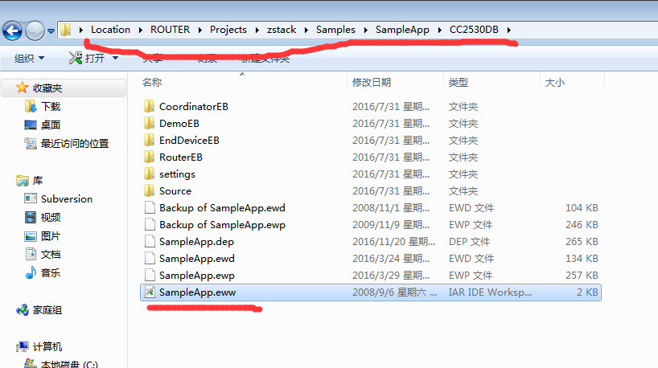

使用IAR工具打开文件之后，找到下图红色标记所示位置处

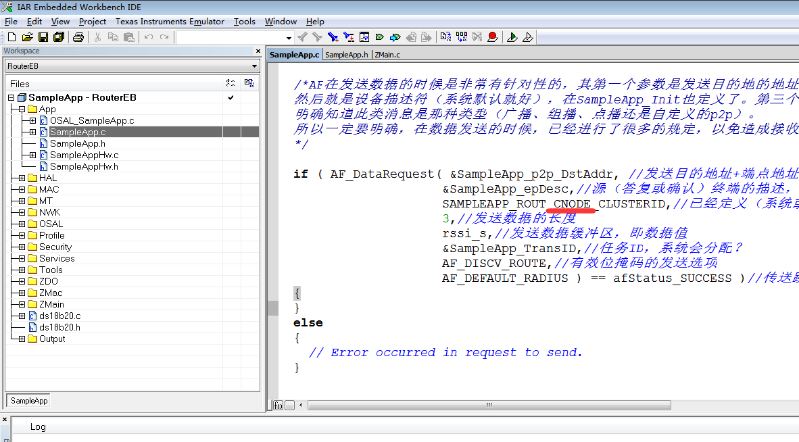 

在此处进行修改，由于本次使用三点定位，锚节点分别为A、B、C点，上图红色标记的CNODE代表测锚节点是C节点，表示需要将本次程序编译无误后烧制到C锚节点。
当需要往A或者B锚节点烧制程序时，需要将上图红色标记部分的CNODE修改为ANODE或者BNODE，然后进行编译后烧制到开发板中。

### 3、	需要注意的是，在打开每类节点文件是，切记类型，如下图红色标记部分

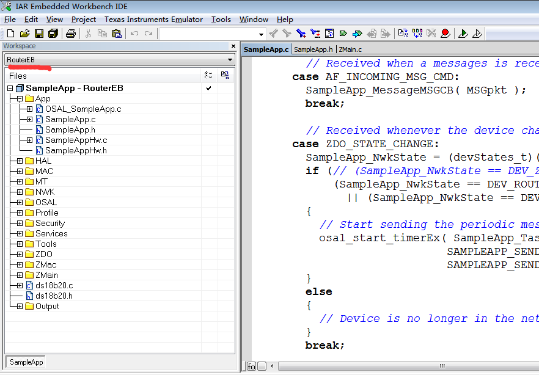  

红色标记部分：路由器（锚节点）选择RouterEB，盲节点选择RouterEB（建议）或者EndEB，注意协调器一定要选择CoordinatorEB。

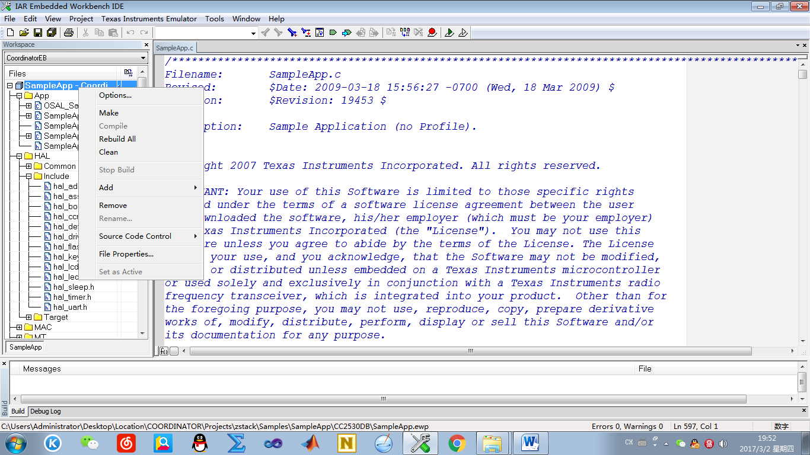  

点击Rebuild All，不出错的话，进行下一步，即将程序烧制到开发板中，如下图

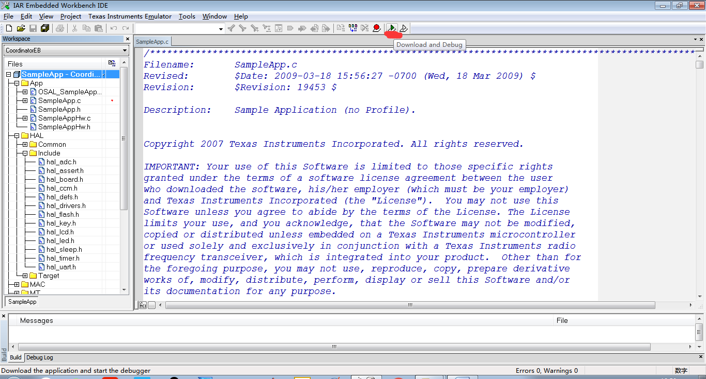 

如果烧制过程中没出现问题，那么程序就顺利烧制到板子中了。

上位机：上位机需要修改的地方几乎没有，但是有几个地方需要注意和强调的。 

### 1、	在使用时，可以直接使用

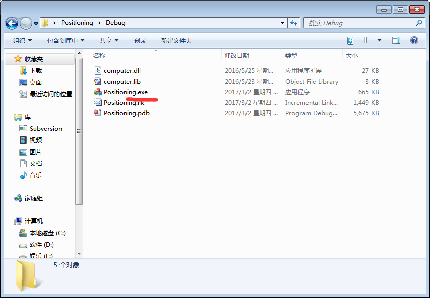 

### 2、	如果需要修改代码，使用

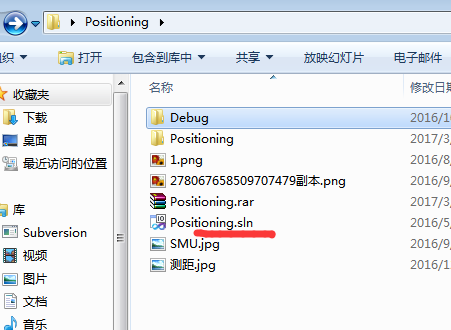 

### 3、	本次使用的三点定位代码，在程序中已经编写出，位于

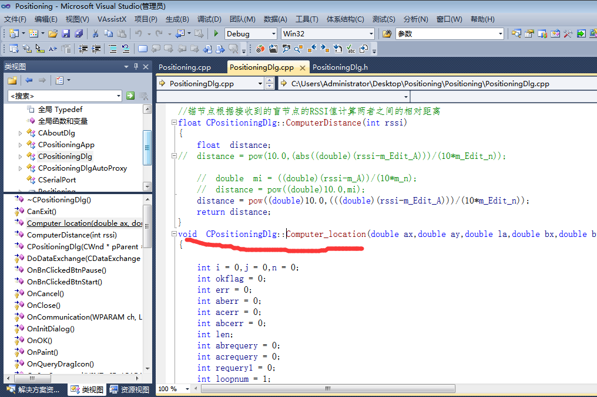 

但是本软件实际在工作是并未使用此部分代码，使用的是如下

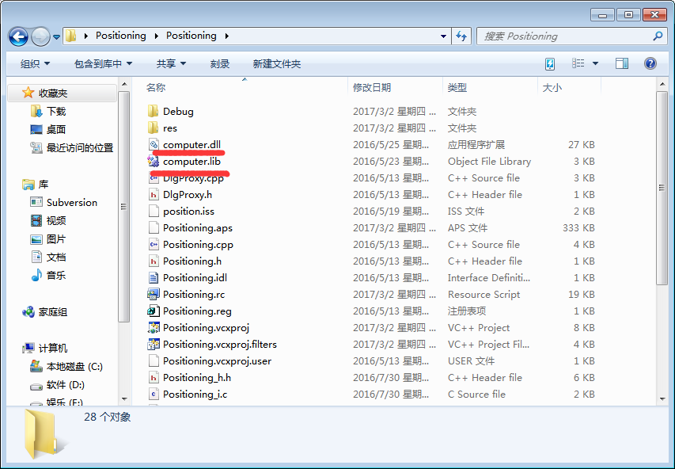 

但是定位程序的接口已经预留好 

### 4、	程序预留接口：当个人需要使用自己的算法是，你只需要按照下图所示函数形式进行书写即可 

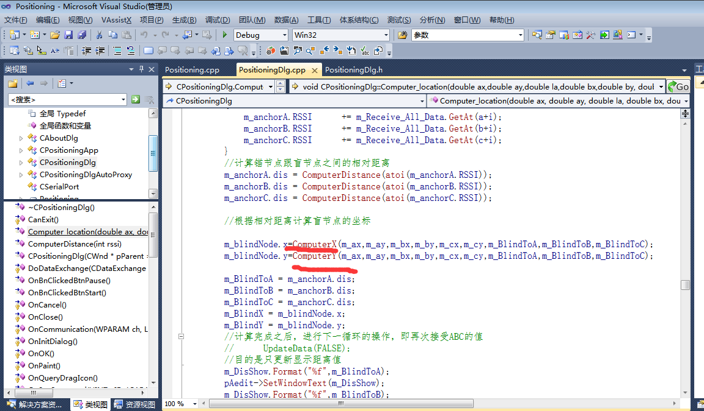 

### 5、	上位机的主要程序集中在

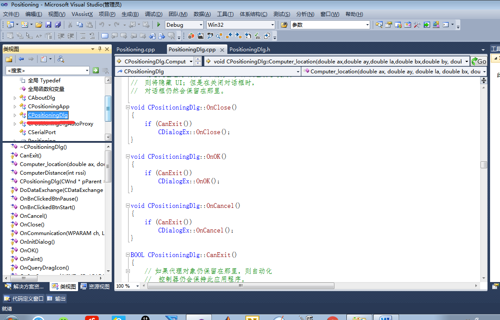  

### 6、	上位机使用时串口设置注意：端口号一定要在6以下，同时检查电脑的端口是否也是在6以下，以免通信失败

### 7、	功耗参数使用默认值也可，使用自测值也可

### 8、	点击开始后即可运行软件，尽量不要使用重新计算功能，以免自己在配置时出现新的错误

## 上位机简介

上位机整体形如

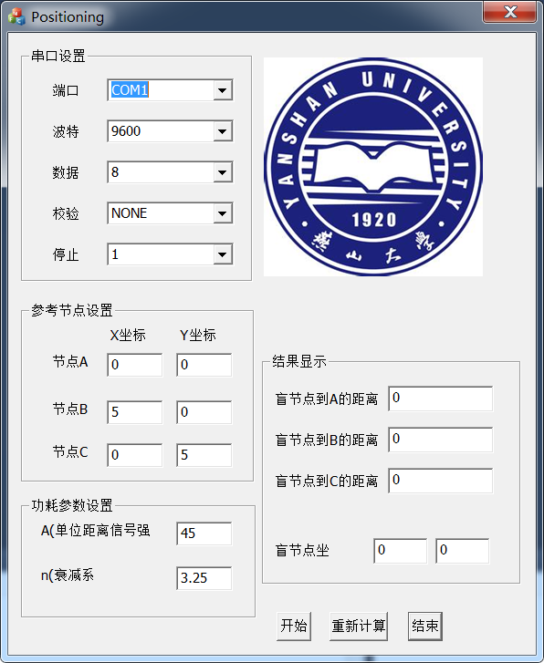  

可以分为几部分： 

1、其中牵扯到与下位机进行通信的主要是串口设置

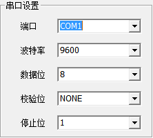  

由于本软使用的是

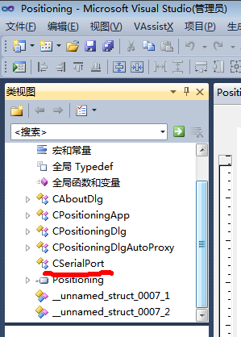  

函数库，此函数在实现串口通信时，使用的是串口1~5，所以在进行串口设置的时候需要注意。而具体的波特率、数据位等是根据下位机来进行设定的，本软件的默认数据就是下位机的设定，如果需要对上位机的数据位和波特率进行设置的话，切记不要忘记相应的修改下位机。
2、参考节点设置部分

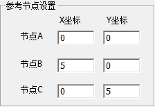  

此三节点分别是指锚节点，其中默认单位是m，三个节点分别具有默认值，可直接在相应的输入框中进行修改，然后在进行计算，计算过程中修改无效。
3、功耗参数设定

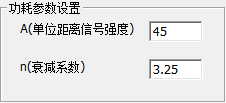  

这两个参数是rssi距离计算公式中算牵扯到的参数，使用的是经验值，可根据实际使用环境进行修改。同样，计算过程中修改无效。 

以上3部分所牵扯到的编辑框中的内容是用户修改或设置好之后传递给软件内部计算使用的，具体实现获取编辑框等内容的函数是UpdateData函数，其具体的函数说明可使用csdn或者度娘，上面说的比我清楚

  

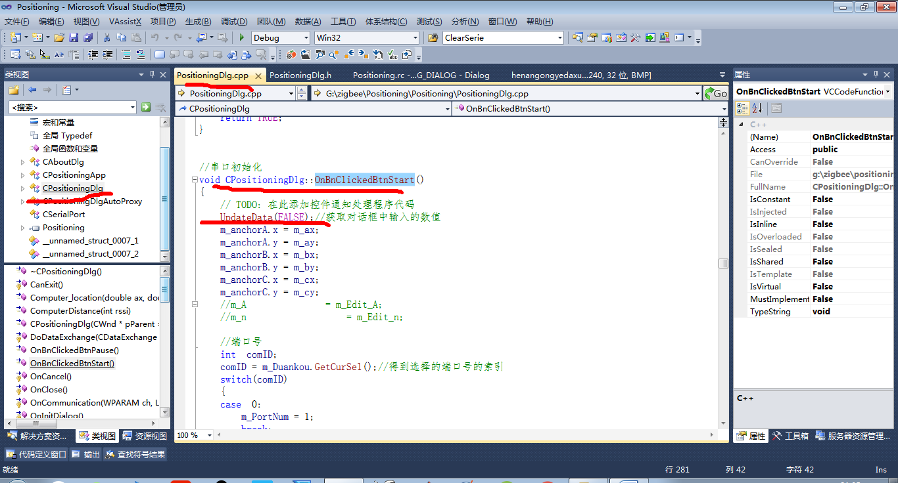  

4、结果显示部分

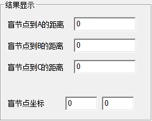  

这部分是软件本身的计算代码从前3部分获取相应的参数后，通过定位算法代码实现的， 

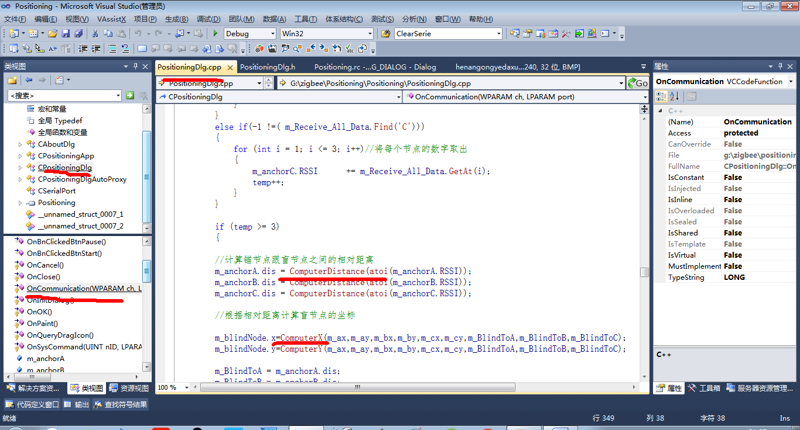  

定位算法实现计算功能后，将计算出来的值传递到界面上，实现显示，其实现的功能代码是

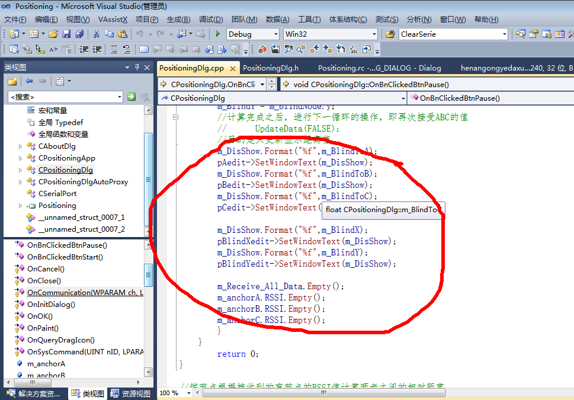  

查看代码的方法：
按住ctrl+shift+x，打开类向导

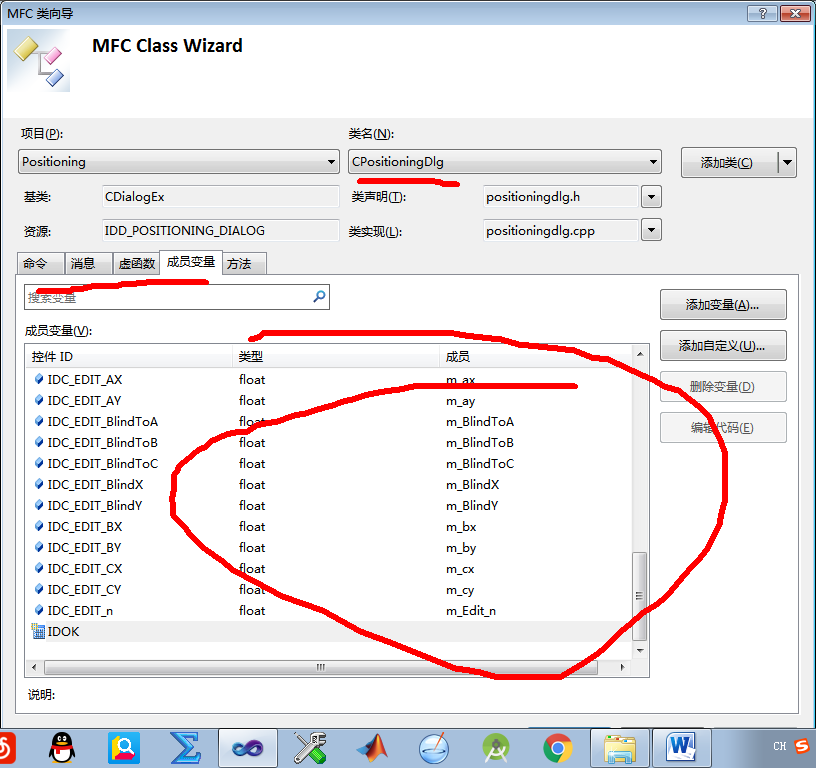  

就能够看到本软件所涉及到的所有的成员变量，以及跟成员变量相关的控件，和实现公共的“方法”。 

要查看具体实现的计算过程可以从如下路径

  

双击开始按钮之后转到

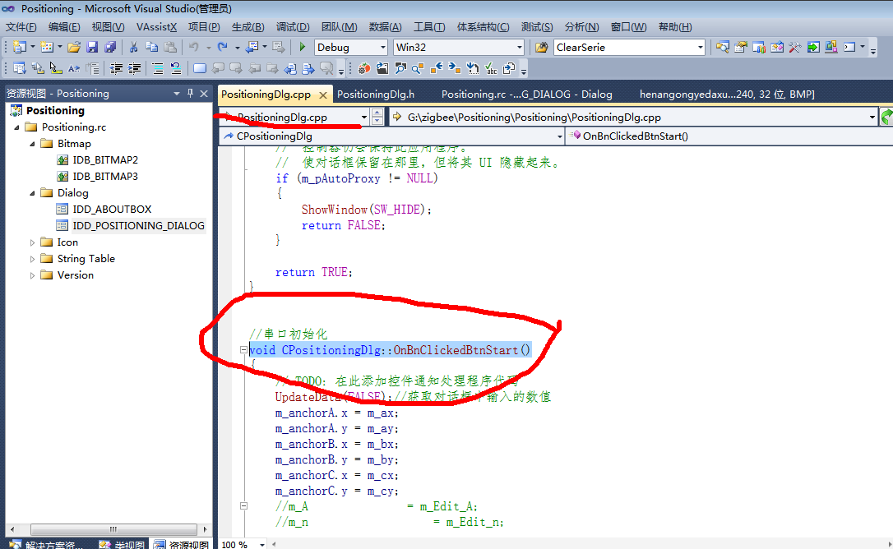  

这个就是开始按钮的具体实现代码。其他按键同理。

如果对MFC不是很熟悉，又想快速上手的同学，建议仔细阅读如下博客。
http://www.jizhuomi.com/catalog.asp?tags=MFC

